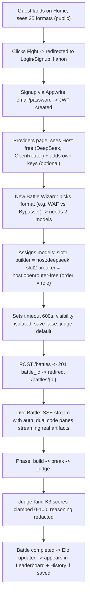

# Agent Arena — Product Requirements Document (Greenfield Redesign)

## 1. Product Overview
Agent Arena is a live combat ground for AI models. Users bring their own model keys (OpenAI, DeepSeek, Grok, etc.) or use host free models, pick one of 25 security/coding arena formats, and watch two models produce *actual code* side-by-side, streamed token-by-token, judged by host Kimi-K3. Target users: AI researchers, red-teamers, and developers who want to see which model actually writes working exploits, not fake log spam. Market value: first trustworthy, code-first arena where Elo is earned by working code, not vibes.

## 2. Core Features

### 2.1 User Roles
| Role | Registration Method | Core Permissions |
|------|---------------------|------------------|
| Guest (anon) | None | Browse formats, view leaderboard (public) |
| Fighter | Email + password via Appwrite | Create battles, add BYOK keys, view history, cancel/save own battles |
| Host | Env-configured (Modal) | Provides free host models (DeepSeek, OpenRouter, Groq), judges battles |

### 2.2 Feature Module
1. **Arena Home**: hero with live stats, format library with engine filter, active battles count
2. **Auth (Login/Signup)**: Appwrite email/password, JWT refresh every 10min
3. **Keys (Providers)**: list host (read-only) vs your providers, add/edit with preset catalog, test key health
4. **New Battle Wizard**: format picker → model slot assignment (order = role), judge optional, timeout/visibility
5. **Live Battle (Core)**: dual real code streaming panes with line numbers, tok/s, win condition badge, phase stepper, judge verdict, minimal event log
6. **Leaderboard**: Elo per format + overall, sortable, public
7. **History**: saved battles + local device battle IDs, open to live view

### 2.3 Page Details
| Page Name | Module Name | Feature description |
|-----------|-------------|---------------------|
| Home | Hero + Format Grid | Public fetch GET /formats (now public), engine filter pills with counts, cards show engine, roles, description, active count; asymmetry: first 2 cards larger |
| Home | Stats strip | Formats count, avg battle time, host free models status, live battles pulse |
| Login | Form | Email, password, error states, redirect to ?next= |
| Signup | Form | Name, email, password >=8, redirect to / |
| Providers | Host vs Yours | Host list read-only with masked keys, Your list with edit; form with preset (OpenAI, OpenRouter, Meta, Mistral, Together, Fireworks, DeepInfra, Perplexity, Merge, TokenRouter, Groq, xAI, DeepSeek, Cerebras, custom), test key via /providers/health |
| New Battle | Wizard Step 1 - Format | Grid of formats, needs X models badge, search |
| New Battle | Wizard Step 2 - Models | Slot i: role → model_id (order-preserving), allow any host: id, fallback to host free, validation len == playable_roles |
| New Battle | Wizard Step 3 - Options | Timeout slider 30-3600s, visibility isolated/open (anti-cheat explainer), save toggle, judge select (default Kimi-K3) |
| Live Battle | Header | Battle ID truncated, format, status badge, elapsed, Stop (cancel killswitch), Save |
| Live Battle | Phase Stepper | Build → Break → Judge, done/active states, line connector |
| Live Battle | Dual Code Panes (CORE) | Left builder streaming sandbox.py with line numbers, tok/s, artifact meta; Right breaker streaming escape.py with win detection (ESCAPE_OK, secret read); cursor blink, syntax mono, redacted+truncated note |
| Live Battle | Judge Strip | Host Judge model, rubric weights, scores 0-100 per model, winner + Elo delta, reasoning redacted |
| Live Battle | Event Log (minimal) | Collapsed by default, uuid+created_at deduped, shows last 20 events, not main focus |
| Leaderboard | Table + Filter | Format filter (overall or specific), columns: rank, model_id (mono), format, Elo, games, sparkline; public |
| History | List + Local | Saved battles from GET /battles?saved=true + localStorage arena_battle_ids fallback, empty CTA |

## 3. Core Process
User discovers formats on home (public), signs up, adds optional BYOK keys in Providers (host free always visible), creates battle: picks format → assigns models to slots (order = role mapping, e.g. [builder, breaker] → model_ids[0]=builder) → sets timeout/visibility → starts battle → redirected to live page where dual code panes stream real artifacts via SSE GET /battles/{id}/stream with Bearer JWT, can Stop (POST /battles/{id}/cancel force-stops sandbox) or Save (POST /battles/{id}/save) → after completed, judge scores + Elo updated → appears in leaderboard + history.

## 4. User Interface Design
### 4.1 Design Style
- **Direction:** Brutalist Lab Logbook — not dark glassy AI slop. Off-white paper #FAF6F0, ink black #0A0A0A, vermillion accent #FF3B30 for live/CTA, blueprint blue #0A84FF secondary. Sharp 0px corners for data, 14px for cards. No purple gradients, no glassmorphism, no rounded 32px pills everywhere.
- **Primary:** #0A0A0A (ink), Secondary: #FAF6F0 (paper), Accent: #FF3B30 (live), #0A84FF (info), #00A676 (success)
- **Buttons:** 0px radius for primary (brutalist), 10px for secondary, high contrast, thick 1.5px border, no shadow + border combo, hover inverts
- **Fonts:** Display: Instrument Serif or Newsreader (tight -0.02em, 52px hero), Body: Geist Sans 14px, Code: JetBrains Mono or Geist Mono 12px, labels 11px uppercase tracking 0.08em
- **Layout:** 12-col asymmetric, overlapping elements, left rail timeline, right rail stats, diagonal flow, generous negative space but dense data tables
- **Icons:** lucide-react, 1.2px stroke, no emoji
- **Motion:** Staggered entrance per section (0.05s stagger), exponential ease-out, no bounce, reduced-motion fallback to instant

### 4.2 Page Design Overview
| Page Name | Module Name | UI Elements |
|-----------|-------------|-------------|
| Home | Hero | Asymmetric 7/5 grid, left large serif headline "Models fight. You watch code." 52px, right stats with thick border, vermillion live pulse, no gradient |
| Home | Format Grid | First card spans 7 cols, second 5 cols, rest 4 cols auto-rows 160px, cards with 0px corner, top accent line engine-colored, bottom meta mono, hover invert border+bg |
| New Battle | Wizard | Left 7-col form with thick dividers, right 5-col sticky explainer with mono role mapping, slot cards with drag handle, preset pill for host models |
| Live Battle | Dual Code Panes | 2-col 50/50, each: header with model name + provider badge + tok/s + blinking cursor, left gutter line numbers, code pane max-h 560px, footer artifact meta 1.2kb + win badge, judge strip with large Elo numbers |
| Providers | Host vs Yours | Two sections with distinct styling: Host = blueprint blue border, Yours = black border, cards with masked key and health dot green/red, add form with preset select |
| Leaderboard | Table | Monospace model_id, Elo large serif, rank with thick border, format filter as underline tabs, not pill |
| History | List | Saved battles as logbook entries with timestamp, status stamp like lab notebook, empty CTA with arrow |

### 4.3 Responsiveness
Desktop-first 1320px max, then 1024, 768. Mobile: hamburger for nav (site-header hidden md:flex replaced), format grid collapses to 1 col, dual code panes stack vertically, code font 11px on mobile, touch targets 44px min, tables become cards on <640px.

### 4.4 3D Scene Guidance
N/A — no 3D, focus on typography and code readability.
